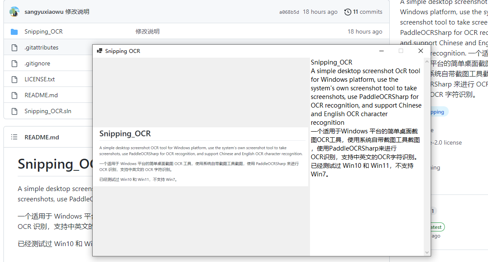

# Snipping_OCR

A simple desktop screenshot OCR tool for Windows platform, use the system's own screenshot tool to take screenshots, use PaddleOCRSharp for OCR recognition, and support Chinese and English OCR character recognition.

一个适用于 Windows 平台的简单桌面截图 OCR 工具，使用系统自带截图工具截图，使用 PaddleOCRSharp 来进行 OCR 识别，支持中英文的 OCR 字符识别。

已经测试过 Win10 和 Win11，不支持 Win7。

  

# Features

- Software supports offline use
- Chinese and English support
- Clipboard image recognition
- Drag and drop

- 离线使用
- 中英文字符识别
- 剪切板识别
- 支持拖拽

# Installation

在仓库的 Releases 下载解压使用即可，无需安装。提供有 windows 的对立版本和 .NET6 框架依赖版本。框架依赖版本需要安装 [.NET6 运行时](https://dotnet.microsoft.com/zh-cn/download/dotnet/6.0)。

# Usage

1. 双击 `Snipping_OCR.exe`启动软件。
2. 最小化将最小化到托盘，关闭为退出软件。
3. 使用快捷键 `Ctrl + Alt + A`启动截图。
4. 若快捷无法正常使用，可以使用其他软件或者系统自带的截图工具 “Win + Shift + S”截图后，在托盘使用右键菜单 “识别剪贴板”来进行 OCR 识别
5. 可以将图片拖放到左边空白区域来识别
6. 复制图片文件后也可以在托盘使用右键菜单 “识别剪贴板”来进行 OCR 识别